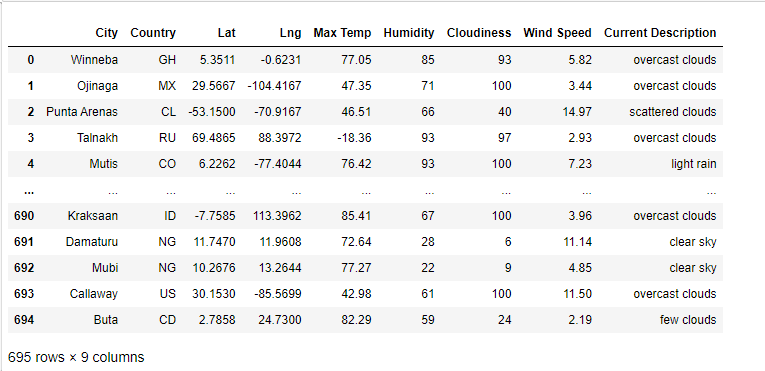
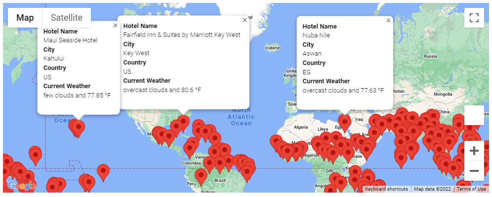
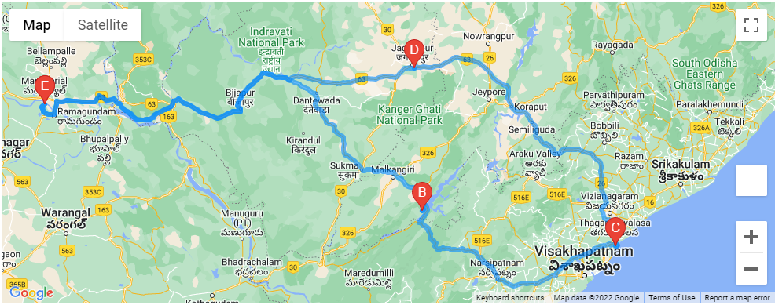
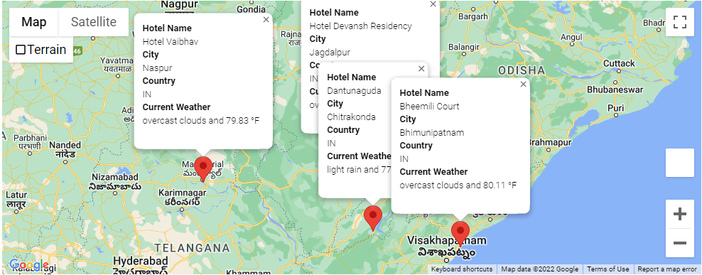

# World_Weather_Analysis

## Project Summary

I used Python, Google's Map & Directions APIs, & OpenWeatherMap's API to perform a number of tasks.
- Created a dataset of cities & their current weather.

- Filtered the dataset of cities to those within 75 - 90 degrees F & added Hotel data.
  - Created a Google marker layer map with pop-up markers for possible vacation destinations along with relevant information.

- Created a travel itinerary map for 4 cities in India & a marker layer for the four cities with pop-up markers.

